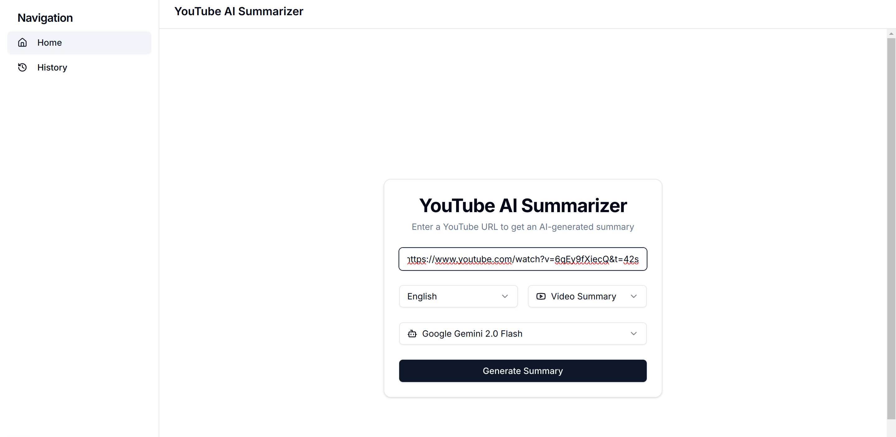
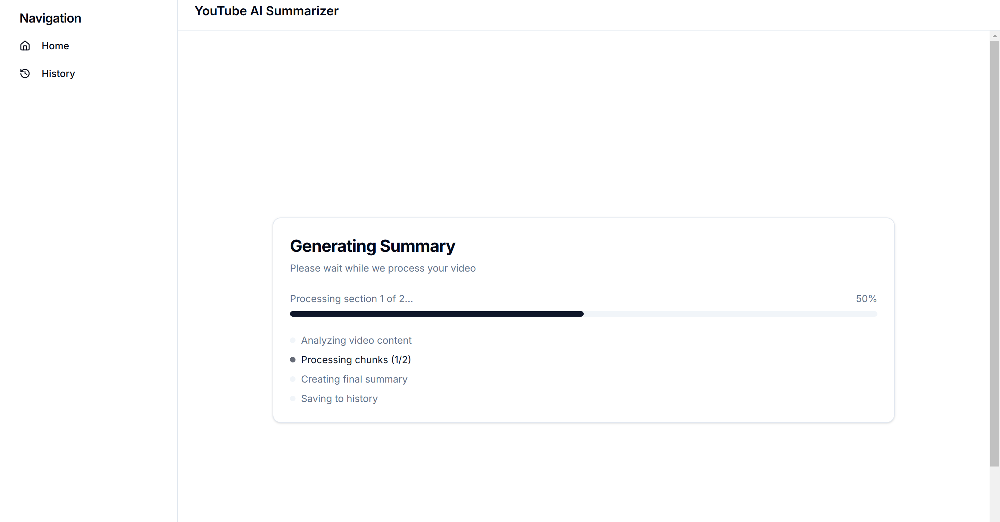
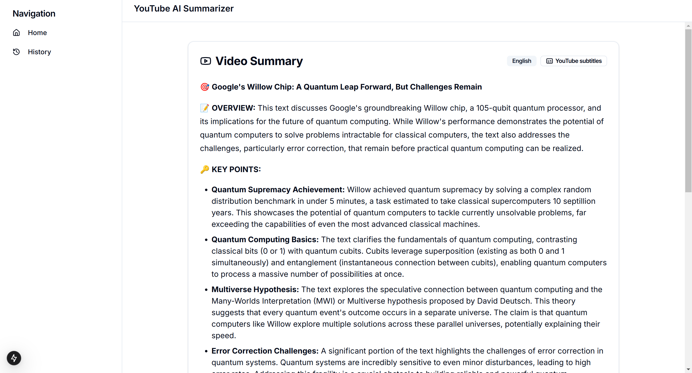
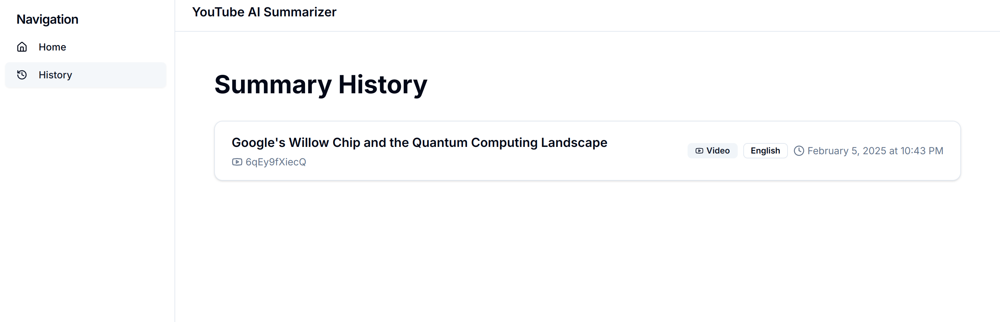
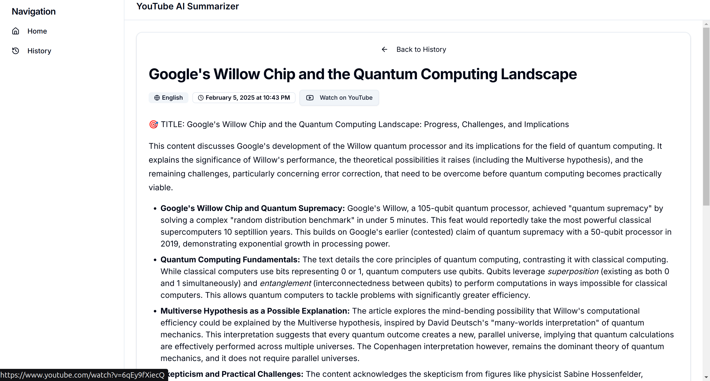

# NEW VERSION -> Python Version is in the branch "old_python_version"

# YouTube AI Summarizer

A modern Next.js-based tool for AI-powered YouTube video summarization. This application allows you to generate concise summaries of YouTube videos using different AI models, with support for multiple languages and summary styles.

## 🎯 Features

- **Multiple AI Models**: Choose your preferred AI model for summarization:
  - Google Gemini 2.0 Flash (Fast and efficient)
  - Groq with Llama 70B (High accuracy)
  - GPT-4o-mini (Balanced performance)
- **Flexible API Key Requirements**:
  - Only one API key is required to start using the application
  - Models become available based on the API keys you provide
  - Mix and match different models as needed
- **Multilingual Support**:
  - Generate summaries in English and German
  - Clean formatting in both languages
  - Proper handling of language-specific structures
- **Flexible Summary Modes**:
  - Video Summary: Concise, structured overview
  - Podcast Style: More narrative, detailed analysis
- **Smart History System**:
  - Automatic storage in SQLite database
  - Quick access to previous summaries
  - Unique constraint handling for video/language combinations
- **Modern UI/UX**:
  - Clean, responsive design with Tailwind CSS
  - Automatic dark/light mode
  - Progress indicators for summarization
  - Beautiful markdown rendering
  - Mobile-friendly interface

## 📱 Interface & Workflow

### 1. Home Screen

The main interface where users can input a YouTube URL and select their preferred language, summary type, and AI model.

### 2. Generation Process

Real-time progress tracking shows the current status of your summary generation, including processing stages and completion percentage.

### 3. Summary View

The generated summary is displayed in a clean, well-structured format with an overview and key points from the video.

### 4. History Dashboard

Access your previously generated summaries through the history dashboard, showing video titles and generation dates.

### 5. Detailed History View

View complete details of past summaries, including full analysis and key points.

## 🚀 Getting Started

### Prerequisites

- Node.js 15.x or higher (for local installation)
- npm package manager (for local installation)
- Docker (optional, for containerized installation)
- API keys for the AI services

### Installation

#### Option 1: Local Installation

1. Clone the repository:
```bash
git clone [repository-url]
cd youtube-summarizer
```

2. Install dependencies:
```bash
npm install
# or
yarn install
```

3. Create a `.env` file in the root directory:
```env
# You only need to add the API keys for the models you want to use
# At least one API key is required
GEMINI_API_KEY="your-gemini-api-key"
GROQ_API_KEY="your-groq-api-key"
OPENAI_API_KEY="your-openai-api-key"
```

4. Set up the database:
```bash
npx prisma generate
npx prisma db push
```

5. Start the development server:
```bash
npm run dev
# or
yarn dev
```

#### Option 2: Docker Installation

1. Clone the repository:
```bash
git clone [repository-url]
cd youtube-summarizer
```

2. Build the Docker image:
```bash
docker build -t youtube-summarizer .
```

3. Run the container:
```bash
docker run -d \
  -p 3000:3000 \
  -v ./prisma:/app/prisma \
  -e GEMINI_API_KEY="your-key" \
  -e GROQ_API_KEY="your-key" \
  -e OPENAI_API_KEY="your-key" \
  youtube-summarizer
```

Note for Docker installation:
- The `-v ./prisma:/app/prisma` flag creates a volume for the SQLite database
- You only need to provide the API keys for the models you want to use
- At least one API key is required
- The application will be available at http://localhost:3000

The application will be available at [http://localhost:3000](http://localhost:3000)

## 🔧 Configuration

### API Key Configuration

The application is designed to work with partial API key configurations:

- You only need to provide API keys for the models you want to use
- The UI will automatically show which models are available based on your API keys
- You can start with just one API key and add more later
- Models without API keys will be disabled in the interface

### Database Setup
The application uses Prisma with SQLite for data persistence. The configuration is defined in `prisma/schema.prisma`:
```prisma
generator client {
  provider = "prisma-client-js"
}

datasource db {
  provider = "sqlite"
  url      = "file:./dev.db"
}
```

To reset the database if you encounter any issues:
```bash
# Remove the existing database
rm prisma/dev.db
# Regenerate the database
npx prisma generate
npx prisma db push
```

### Obtaining API Keys

1. **Google Gemini API Key** (Good starting choice - free tier available):
   - Visit [Google AI Studio](https://aistudio.google.com/app/apikey)
   - Create a new project if needed
   - Generate an API key
   - Free tier available with generous limits

2. **Groq API Key**:
   - Go to [Groq Cloud](https://console.groq.com/)
   - Sign up for an account
   - Navigate to API settings
   - Generate a new API key

3. **OpenAI API Key**:
   - Visit [OpenAI Platform](https://platform.openai.com/api-keys)
   - Create an account or log in
   - Go to API settings
   - Generate a new API key
   - Note: This service requires a paid subscription

## 🆕 Technical Highlights

### Recent Migration from Python
- Previously built with Python and Streamlit
- Completely rebuilt using Next.js for better performance
- New architecture using the App Router for improved routing
- Enhanced state management and real-time updates

### Performance Improvements
- Streaming responses for real-time progress updates
- Efficient chunk processing for long videos
- Smart caching of summaries
- Optimized database queries

### Modern Tech Stack
- **Frontend**: Next.js 15+, React, TypeScript
- **Styling**: Tailwind CSS, shadcn/ui components
- **Database**: Prisma with SQLite
- **AI Integration**: Multiple model support
- **API**: Built-in API routes with streaming support

## 📚 Usage

1. Visit the homepage
2. Paste a YouTube URL
3. Select your preferred:
   - Language (English/German)
   - Summary mode (Video/Podcast)
   - AI model
4. Click "Generate Summary"
5. Watch the real-time progress
6. View your formatted summary
7. Access previous summaries in the history section

## 🤝 Contributing

Contributions are welcome! Please feel free to submit a Pull Request.

## 📝 License

This project is licensed under the MIT License - see the LICENSE file for details.

## 🚨 Troubleshooting

### Database Issues

If you encounter database errors like "database disk image is malformed", follow these steps:

1. Stop the development server
2. Delete the corrupted database:
   ```bash
   rm prisma/dev.db
   ```
3. Regenerate the database:
   ```bash
   npx prisma generate
   npx prisma db push
   ```
4. Restart the development server:
   ```bash
   npm run dev
   ```

### API Errors

If you encounter API errors:

1. Check that all environment variables are properly set in `.env`
2. Verify that your API keys are valid and have sufficient credits
3. For history-related errors, try resetting the database as described above

### Common Issues

1. **"Invalid API Key" errors**:
   - Double-check your API keys in `.env`
   - Make sure there are no extra spaces or quotes
   - Verify the keys are active in their respective platforms

2. **"Failed to fetch summaries" error**:
   - Usually indicates a database issue
   - Follow the database reset steps above
   - Check if your database has proper read/write permissions

3. **Performance issues**:
   - Long videos may take more time to process
   - Consider using Gemini model for faster processing
   - Check your network connection