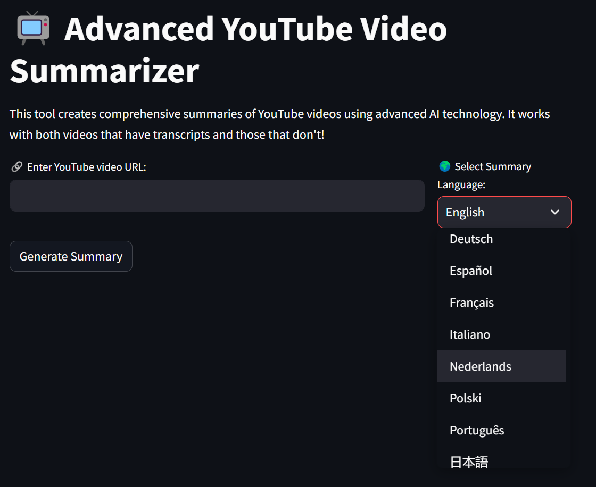
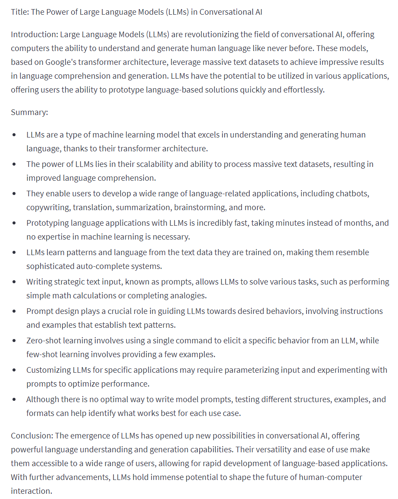

# YouTube Video Summarizer

This is a Python application that allows you to summarize the content of a YouTube video using OpenAI's GPT-3.5 language model and Langchain. The application get the transcription provided by YouTube, chunks the Transcription with Langchain and generates a summary in the language of the youtube video.

## Features
- Get the Transcription from Youtube
- Chunks the transcriptions with Langchain
- Summarizes transcribed text using OpenAI's GPT-3.5 model
- Built with Streamlit for an easy-to-use web interface

## Prerequisites

Before you begin, ensure you have installed the following:

- Python 3.6 or above
- [Streamlit](https://streamlit.io/)
- [PyTube](https://pytube.io/en/latest/)
- [OpenAI](https://beta.openai.com/docs/developer-quickstart/)
- [python-dotenv](https://pypi.org/project/python-dotenv/)
- [youtube-transcript-api](https://pypi.org/project/youtube-transcript-api/)
- [Langchain](https://pypi.org/project/langchain/)

## Installation 

1. Clone this repository:
```bash
git clone https://github.com/DevRico003/youtube_summarizer
```
2. Change into the cloned repository:
```bash
cd youtube_summarizer
```
3. Install all necessary packages:
```bash
pip install -r requirements.txt
```
4. Create a `.env` directory in your home directory (or any directory of your choice), and create in the directory `.env` a file called `openai_api` and add your OpenAI API Key:
```bash
OPENAI_API_KEY=your_openai_api_key
```
5. Change the `env_path` variable in the Python script to match the path of your `.env` file.

## Usage

1. Run the script:
```bash
streamlit run app.py
```
2. Once the web application starts, open it in your web browser.

3. Enter the link of the YouTube video you want to summarize in the provided text input.

4. Click the "Start" button to begin the summarization process.

   - The application will get the Transcription from Youtube
   - It will then use GPT-3.5 and Langchain to generate a summary.
   - The generated summary will be displayed on the web page in the language of the youtube video.

5. The summary will be presented in the form of an informative and factual overview of the video's content, including bullet points if possible. It will also include an introduction and conclusion phrase.

## Example
### Insert Youtube link, choose the language and press start

### Result

## Disclaimer

Please note that this application relies on the OpenAI GPT-3.5 language model, and its performance and results are subject to the capabilities of the model and the quality of the provided data. The generated summaries may not always be perfect and may require manual editing for accuracy.

## Contributing

Contributions are what make the open-source community such an amazing place to learn, inspire, and create. Any contributions you make are greatly appreciated.

## License

Distributed under the MIT License. See `LICENSE` for more information.