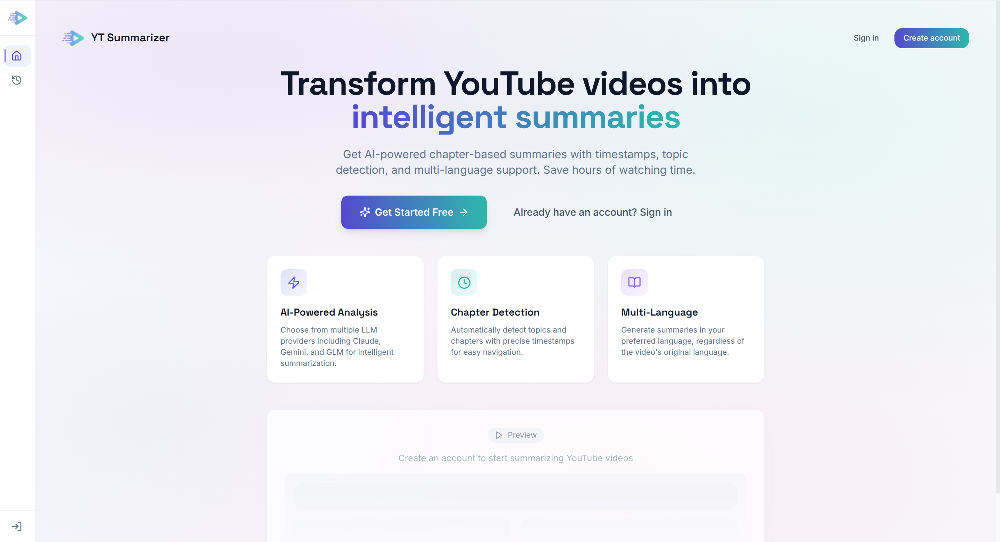
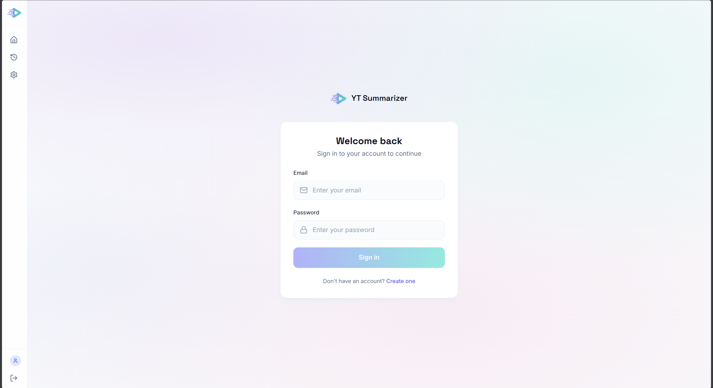
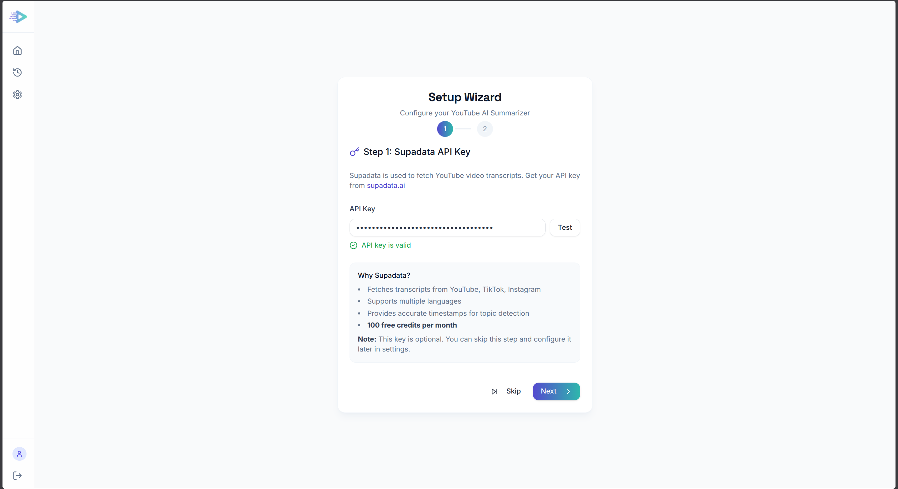
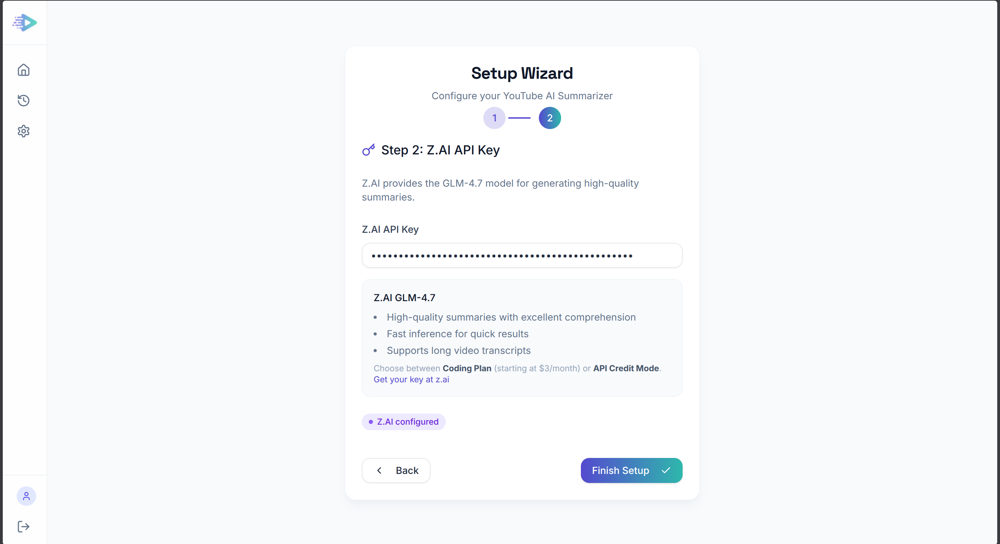
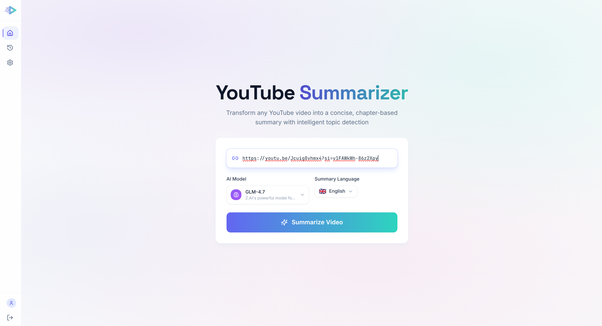

# YouTube Summarizer v2

[](https://opensource.org/licenses/MIT)
[](https://nodejs.org/)



**AI-powered YouTube video summarization with smart chapter detection, multi-language support, and clickable timestamps.**

Transform lengthy YouTube videos into structured, digestible summaries. YouTube Summarizer v2 automatically detects chapters and topics, generates summaries in your preferred language, and provides clickable timestamps that jump directly to video positions.

## Features

- **Smart Chapter Detection** - Automatically identifies chapters and topics with precise timestamps
- **Multi-Language Support** - Generate summaries in English, German, French, Spanish, or Italian
- **Clickable Timestamps** - Jump directly to any video position from the summary
- **Visual Chapter Timeline** - See video structure at a glance with an interactive timeline
- **Full Transcript View** - Access the complete transcript with clickable timestamps
- **Markdown Export** - Download summaries as markdown files
- **Summary Caching** - Summaries are cached per-user, per-video for instant access
- **Permanent History** - All summaries are archived and searchable
- **Secure Authentication** - HTTP-only cookie sessions with [better-auth](https://better-auth.com)
- **Password Recovery** - Security questions for self-service password reset

## Prerequisites

- **Node.js 20+** - [Download](https://nodejs.org/)
- **Supadata Account** - For YouTube transcript extraction
  - Sign up at [supadata.ai](https://supadata.ai/?ref=devrico003) (referral link)
  - Free tier: 100 credits/month
- **Z.AI Account** - For AI summarization (GLM-4.7)
  - Sign up at [z.ai](https://z.ai/subscribe?ic=D7NHC27OHD) (referral link)
  - Pricing: Coding Plan from $3/month or API on-demand

> **Disclosure**: The links above are referral links. Using them helps support this project at no extra cost to you.

## Installation

### Without Docker

```bash
# 1. Clone the repository
git clone https://github.com/DevRico003/youtube_summarizer.git
cd youtube_summarizer

# 2. Install dependencies
npm install --legacy-peer-deps

# 3. Configure environment
cp .env.example .env

# Generate secrets and add to .env:
openssl rand -hex 32      # For APP_SECRET
openssl rand -base64 32   # For BETTER_AUTH_SECRET

# 4. Setup database
npx prisma generate
npx prisma db push
npx prisma db seed

# 5. Run development server
npm run dev
```

For production:
```bash
npm run build
npm start
```

### With Docker

```bash
# 1. Clone the repository
git clone https://github.com/DevRico003/youtube_summarizer.git
cd youtube_summarizer

# 2. Configure environment
cp .env.example .env

# Generate secrets and add to .env:
openssl rand -hex 32      # For APP_SECRET
openssl rand -base64 32   # For BETTER_AUTH_SECRET

# 3. Run with docker-compose
docker-compose up -d
```

The application will be available at `http://localhost:3000`.
Database migrations and seeding (security questions) run automatically on first start.

## Environment Variables

| Variable | Required | Description |
|----------|----------|-------------|
| `APP_SECRET` | Yes | Secret key for encryption. Generate with `openssl rand -hex 32` |
| `BETTER_AUTH_SECRET` | Yes | Secret for session signing. Generate with `openssl rand -base64 32` |
| `BETTER_AUTH_URL` | No | Base URL for auth callbacks. Default: `http://localhost:3000` |
| `NEXT_PUBLIC_APP_URL` | No | Public app URL. Default: `http://localhost:3000` |
| `DATABASE_URL` | No | SQLite database path. Default: `file:./dev.db` (auto-configured for Docker) |

## User Guide

### 1. Registration
Create an account with your email and password. During registration, you'll set up 3 security questions for password recovery. Each user has their own isolated data and API keys.


### 2. Setup Wizard
On first login, the setup wizard guides you through configuring:
1. **Supadata API Key** - For YouTube transcript extraction
2. **Z.AI API Key** - For AI-powered summarization



### 3. Summarizing a Video
1. Paste a YouTube URL into the input field
2. Select your preferred summary language
3. Click "Summarize"
4. Wait for the AI to process the video


### 4. Viewing Summaries
- **Compact View**: Chapters are collapsible for easy navigation
- **Full Text View**: See the complete summary with all details
- **Timeline**: Visual representation of video chapters


### 5. Using Timestamps
Click any timestamp in the summary or transcript to open the video at that exact position.

### 6. Exporting
Click the download button to export your summary as a markdown file.

### 7. Settings
Update your API keys anytime from the Settings page.

## Tech Stack

- **Framework**: [Next.js 15](https://nextjs.org/) (React 19)
- **Language**: [TypeScript](https://www.typescriptlang.org/)
- **Authentication**: [better-auth](https://better-auth.com/) (HTTP-only cookies)
- **Styling**: [Tailwind CSS](https://tailwindcss.com/)
- **Database**: [Prisma](https://www.prisma.io/) + SQLite
- **Animations**: [Framer Motion](https://www.framer.com/motion/)
- **LLM**: [Z.AI GLM-4.7](https://z.ai/subscribe?ic=D7NHC27OHD)
- **Transcripts**: [Supadata API](https://supadata.ai/?ref=devrico003)

## Cloud Deployment

### General Notes
- Ensure `APP_SECRET` and `BETTER_AUTH_SECRET` are set as environment variables
- Set `BETTER_AUTH_URL` and `NEXT_PUBLIC_APP_URL` to your production domain
- SQLite database requires persistent volume storage
- Container exposes port 3000

### VPS (Docker)
1. Clone repository on your server
2. Configure `.env` with secrets and production URLs
3. Run `docker-compose up -d`
4. Configure reverse proxy (nginx/Caddy) for HTTPS

## v1 vs v2

YouTube Summarizer v2 is a complete rewrite focused on simplicity:

- **Streamlined UX** - Removed preferences and templates for a cleaner flow
- **Transcript extraction & creation** - Transcript extraction with timestamps and if no timestamps available supadata does analyse the video and create them
- **Setup Wizard** - Guided API key configuration
- **Per-User Isolation** - Each user manages their own API keys and data
- **New LLM** - Z.AI GLM-4.7 as primary model (more providers planned)

## Contributing

Contributions are welcome! Feel free to:
- Open issues for bugs or feature requests
- Submit pull requests

## License

This project is licensed under the MIT License - see the [LICENSE](LICENSE) file for details.
