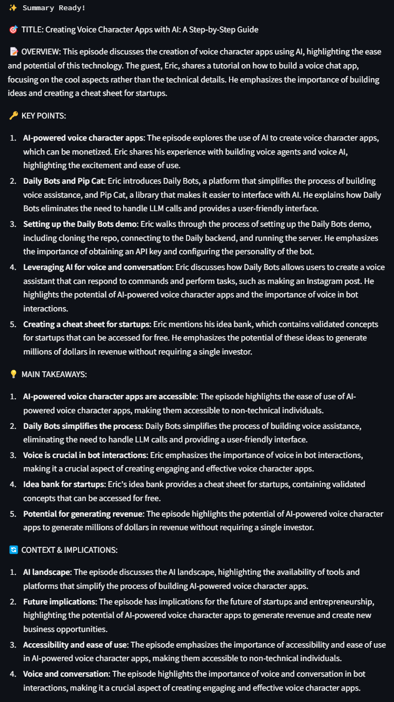

# OLD PYTHON VERSION

# Advanced YouTube Video Summarizer

This is a Python application that creates comprehensive summaries of YouTube videos using Groq's AI models. The application can either use YouTube's transcription or create its own using Groq's Whisper Large V3 Turbo when no transcript is available.

## Features
- Automatic transcript extraction from YouTube videos
- Fallback to audio transcription using Groq's Whisper Large V3 Turbo
- Advanced text chunking with Langchain
- Comprehensive summarization using Llama 3.1 8B Instant
- Multi-language support with 12+ languages
- Language selection for summaries
- Structured summaries with clear sections
- Clean and intuitive Streamlit web interface
- Progress tracking and status updates

## Prerequisites

Before you begin, ensure you have installed:

- Python 3.6 or above
- FFmpeg (required for audio processing)

## Installation 

1. Clone this repository:
```bash
git clone https://github.com/DevRico003/youtube_summarizer
```

2. Change into the project directory:
```bash
cd youtube_summarizer
```

3. Install required packages:
```bash
pip install -r requirements.txt
```

4. Install FFmpeg (Ubuntu/Debian):
```bash
sudo apt-get update
sudo apt-get install ffmpeg
```
For other operating systems, please refer to the [FFmpeg installation guide](https://ffmpeg.org/download.html)

5. Create a `.env` file in your project directory and add your Groq API Key:
```bash
GROQ_API_KEY=your_groq_api_key
```

6. Update the `env_path` variable in `app.py` to match your `.env` file location.

## Usage

1. Start the application:
```bash
streamlit run app.py
```

2. Open your web browser to the provided URL (typically http://localhost:8501)

3. Enter a YouTube video URL in the input field

4. Select your desired summary language from the dropdown menu

5. Click "Generate Summary"

## Example Usage

### 1. Enter YouTube URL and Select Language


### 2. View Generated Summary


The application will:
- Attempt to fetch the YouTube transcript
- If no transcript is available, download and transcribe the audio using Groq's Whisper
- Process and chunk the text appropriately
- Generate a comprehensive summary with the following sections:
  - 🎯 Title
  - 📝 Overview
  - 🔑 Key Points
  - 💡 Main Takeaways
  - 🔄 Context & Implications

## Summary Structure

Each summary includes:
- A descriptive title
- A brief overview (2-3 sentences)
- Key points with examples and data
- Practical insights and actionable conclusions
- Context and broader implications

## Error Handling

The application includes robust error handling for:
- Invalid YouTube URLs
- Missing transcripts
- Failed audio downloads
- API errors
- Network issues

## Technical Details

- Uses Groq's API with OpenAI compatibility layer
- Implements efficient text chunking with Langchain
- Uses Llama 3.1 8B Instant model for summarization
- Employs yt-dlp for reliable video processing
- Includes automatic cleanup of temporary files
- Features progress tracking and user feedback

## Language Support

The application supports summaries in multiple languages:
- English
- German (Deutsch)
- Spanish (Español)
- French (Français)
- Italian (Italiano)
- Dutch (Nederlands)
- Polish (Polski)
- Portuguese (Português)
- Japanese (日本語)
- Chinese (中文)
- Korean (한국어)
- Russian (Русский)

Simply select your preferred language from the dropdown menu, and the summary will be generated in that language, regardless of the original video language.

## Contributing

Contributions are welcome! Please feel free to submit a Pull Request.

## License

Distributed under the MIT License. See `LICENSE` for more information.

## Disclaimer

This application uses Groq's API services. Usage will incur costs based on your Groq account. Please review Groq's pricing structure before extensive use.

## Cookie Setup for YouTube Authentication

To access YouTube transcripts, you need to provide authentication cookies. Follow these steps:

### 1. Install Cookie Extension
1. Open the Chrome Web Store
2. Search for "Get cookies.txt"
3. Install the "Get cookies.txt LOCALLY" extension
4. Click the extension icon to ensure it's pinned to your browser

### 2. Export YouTube Cookies
1. Go to [YouTube](https://www.youtube.com)
2. Sign in to your YouTube/Google account
3. Click the "Get cookies.txt" extension icon
4. Click "Export" to download the cookies file

### 3. Configure the Application
1. Rename the downloaded file to `cookies.txt`
2. Place the `cookies.txt` file in the same directory as `app.py`
3. Ensure the file permissions are correct (readable by the application)

Note: Keep your cookies.txt file secure and never share it publicly, as it contains your authentication information.
